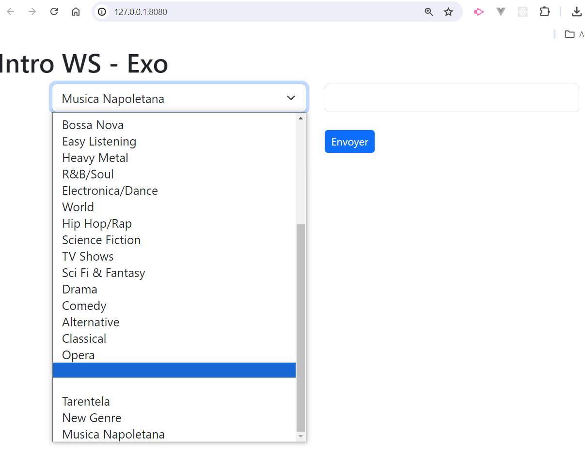

# Intro WS - Exo

## Consignes
En vous inspirant de cette [vidéo](https://www.youtube.com/watch?v=46tUIyqNS5k) et de cette capture 

créer une interface web affichant les deux éléments suivants:

1. Un menu déroulant dont les choix seront alimentés par des genres musicaux provenant de la base __chinook.db__ (table __genres__)

2. Un micro formulaire permettant d'enregistrer dans la base un nouveau genre musical.
Prévoir un champ de saisie, un bouton d'envoi ainsi qu'une zone dans le dom permettant d'indiquer à l'utilisateur le résultat de sa reqûete (échec, succès)

Option (facultative): utiliser bootstrap pour cette interface utilisateur.

Créer un service web exposant les endpoints permettant:
- d'obtenir les liste des genres musicaux
- d'ajouter un nouveau genre en base de données