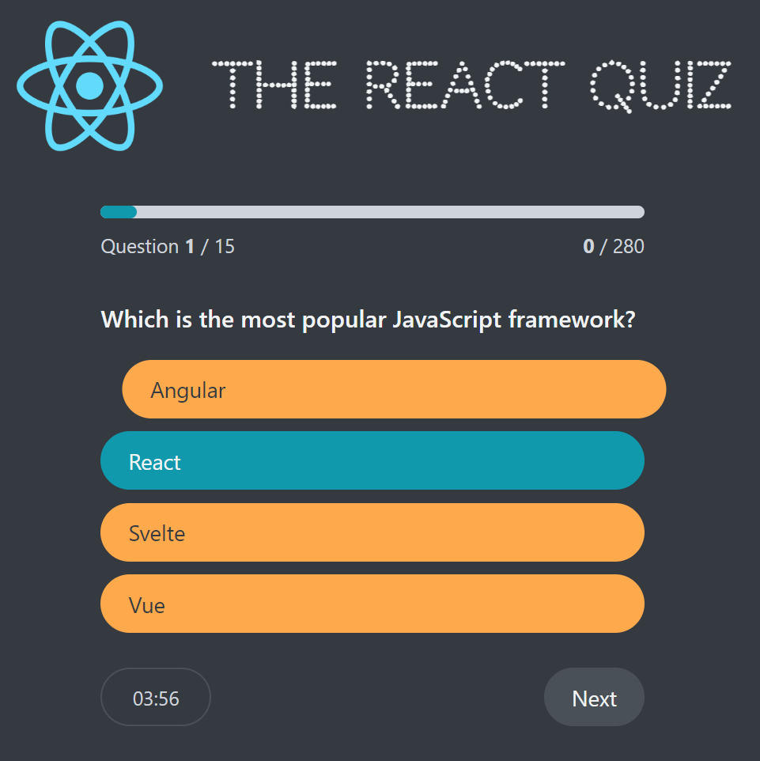
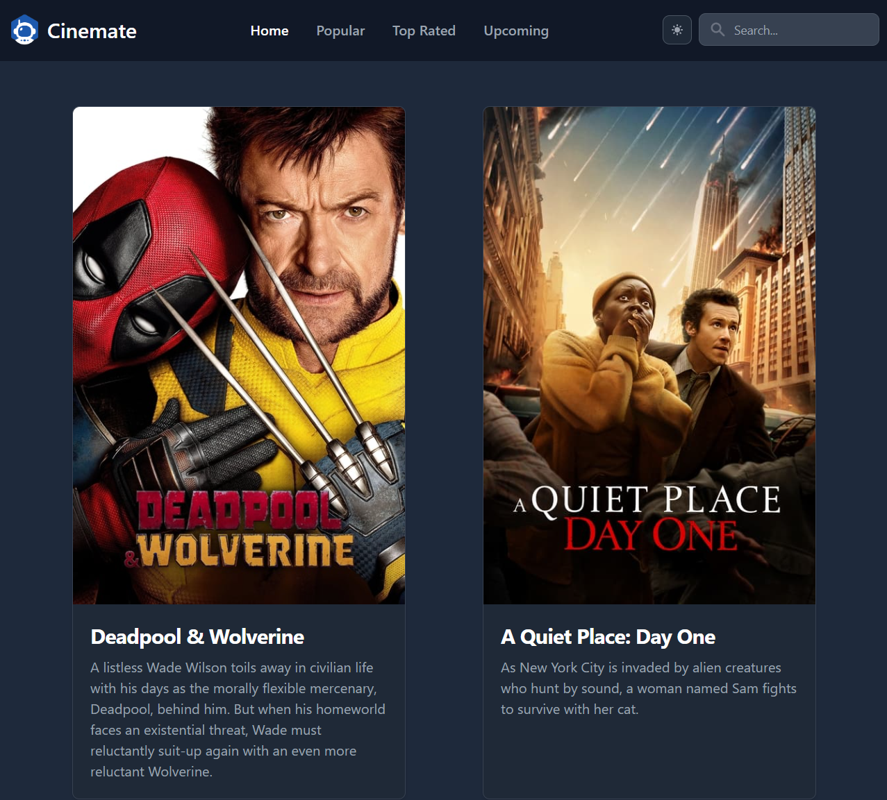

# Projet - frameworks

Réaliser <strong>au moins</strong> l'un des deux projets suivants avec le framework de votre choix parmi les frameworks suivants: Angular, Vuejs et Reactjs.
Réaliser, si possible (en fonction de votre rythme), l'autre projet avec <strong>un autre</Strong> framework que celui utilisé pour le premier projet réalisé.

## Projet1 : The React Quizz
Reproduire au plus près l'application utilisée dans <a href="https://youtu.be/W1cp5KsojLc?si=uTlWDm-M-7nnF1H6">cette vidéo</a>.
 

 
<strong>Notes</Strong>  
- police utilisée pour le titre: Codystar
- les données (questions.json) seront servies par json-server sur le port 9000
- la présence composant de compte à rebours (en bas à gauche dans l'interface) est optionnelle mais serait appréciée.

## Projet2: Cinemate
Reproduire au plus près <a href="https://cinemate-ul.netlify.app/">cette application en ligne</a>
 

 
<strong>Notes</Strong>  
- API utilisée: <a href="https://www.themoviedb.org/">themoviedb.org</a>
- [Tutoriel youtube d'utilisation de l'API The Movie Database](https://youtu.be/FlFyrOEz2S4?si=IXETilLbu0UEHJ-b)