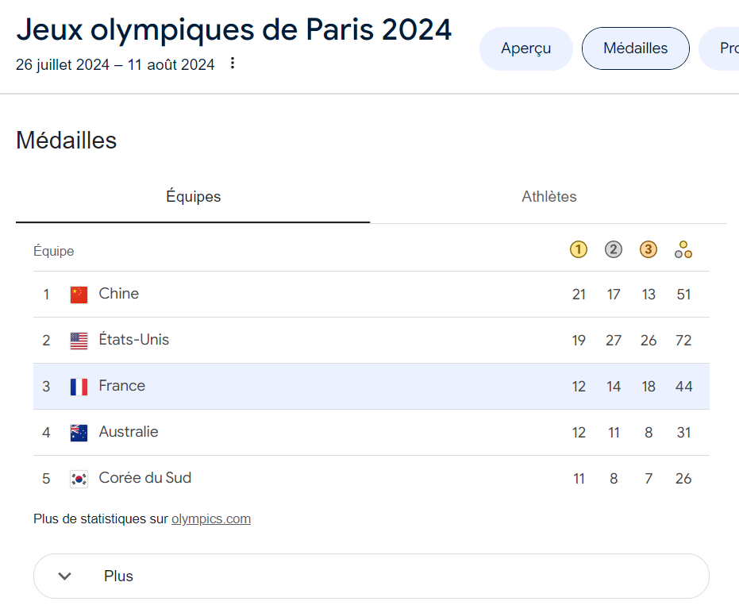
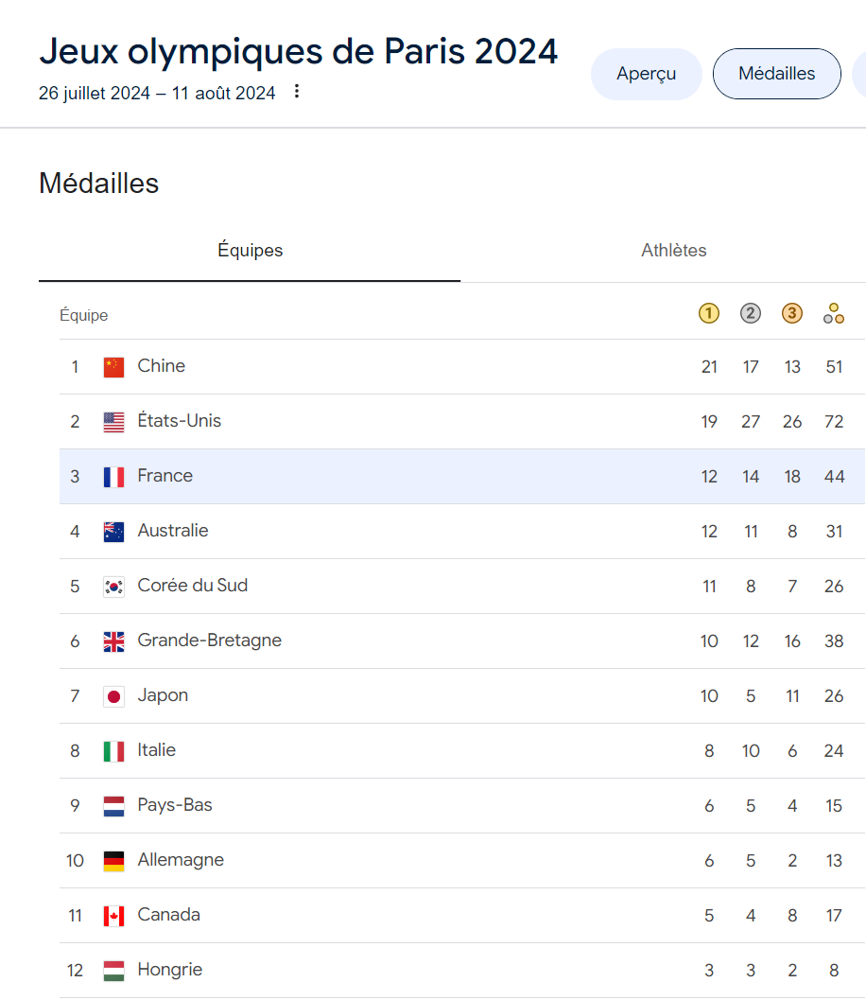

# TP JO (Jeux Olympiques)

Créer une application React en vous inspirant de l'onglet "Equipes"  des capture suivantes:

Par défaut, afficher 5 pays (affichage "compact")
  
  
Affichage les 7 autres pays après clic sur le bouton "Plus" (qui alors devient "Moins"):
  
  
Utiliser json-server pour récupérer les données (les données des 12 pays) depuis le fichier db.json.  

  
Option (facultative): afficher les pays par ordre de médailles décroissant du nombre de médailles d'or obtenu.