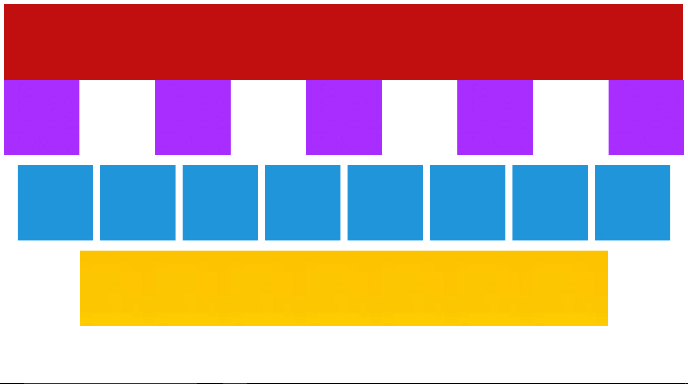

# Exo flexbox

## Vidéos pour comprendre Flexbox (au choix)
- [Learn CSS flexbox in 10 minutes! 💪 - youtube - EN](https://youtu.be/GteJWhCikCk?si=UeeJaS5-VUttSQ31)
- [FlexBox Tutorial - youtube - FR - 12 min](https://youtu.be/DPHgIIdrmFk?si=4ZoMpY2DwZB1iBRO)
- [Apprendre Flexbox en 18 minutes (cours + exercices corrigés) - youtube - FR](https://youtu.be/f0xYbL9yn24?si=sgQpR3LCrEreSXh5)

## Consignes
En utilisant, les propriétés css __flex-direction__, __flex-wrap__, __justify-content__, __align-items__, réaliser une mise en page du fichier index.html similaire à cette capture:
